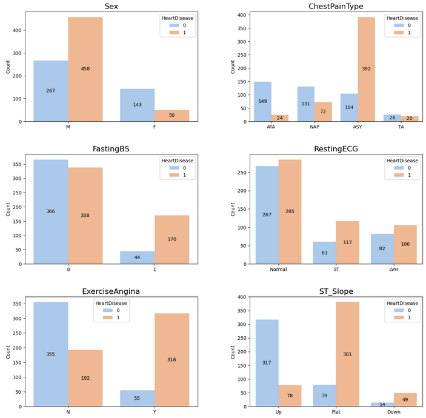

# Predicting Heart Disease

In this guided project, we are working for a fictional company focused on finding solutions for health conditions. Our goal is to build a machine learning model that can predict the likelihood of a person developing a cardiovascular disease in the future. We will be working with a Kaggle dataset that can be found [here.](https://www.kaggle.com/datasets/fedesoriano/heart-failure-prediction)

View this project live on Google Colab [here](https://colab.research.google.com/drive/15fE-j1eh1uEzhRn6s53yDCo7_CfgkuNf?usp=sharing).
